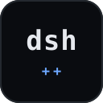

# dsh-plus-plus

<p align="center"></p>

**dsh-plus-plus** is a local-first control plane and operational tooling for [DeepSeek Harness](https://github.com/deepseek-ai/deepseek-harness) (`dsh`). It runs on your machine, reads the same `$DSH_HOME` state the harness does, and surfaces it through a CLI and a loopback-only web console.

It does not replace the harness. It covers the operational gaps the harness does not ship:

- **Lifecycle** — detect the install, snapshot and roll back configuration, run diagnostics.
- **Plugin security audit** — inventory installed plugins, classify the capabilities (seams) each one touches, and grade risk.
- **Regression testing for DSH workflows** — run a fixed set of harness tasks against the current DSH configuration (model, prompt, plugins, config, harness version), compare to a stored baseline, and flag what an upgrade or change broke.


## Requirements

- Node.js >= 20.
- No third-party runtime dependencies. Built-in `node:zlib` decodes the concatenated-zstd session logs.

## Install

```sh
npm i -g .
```

Or install it as a harness plugin (adds a `/dshpp` slash command):

```sh
dsh plugin --profile web add github:limlnx523/dsh-plus-plus
```

## Quick start

```sh
dshpp status     # overview
dshpp doctor     # diagnostics
dshpp audit      # plugin security risk report
dshpp test       # regression-test the DSH workflow vs baseline
```

## Example

```text
$ dshpp status

[DSH++] DeepSeek Harness · status
----------------------------------------------------
  DSH home        C:\Users\you\.dsh
  dsh CLI         present (C:\Users\you\AppData\Roaming\npm\dsh)
  .env            found — 1 key(s), 1 secret(s) hidden
  settings.yaml   C:\Users\you\.dsh\settings.yaml
  provider keys   (none detected)
  backups         2 snapshot(s)
  DSH++ home      C:\Users\you\.dsh-plus-plus
----------------------------------------------------
  health: run `dshpp doctor` · console: run `dshpp web`

$ dshpp audit

[DSH++] DeepSeek Harness · control plane · plugin security audit  (197 plugin(s) · dsh 0.1.1-rc.2)
  risk: 高=8  中=69  低=120
  [中] @deepseek-ai/cordis-plugin-hmr@1.0.16  官方  seams=fs
  [高] @deepseek-ai/dsh-client-connection@0.1.1-rc.2  官方  seams=network,shell,credentials,goal
  [高] @deepseek-ai/dsh-host-apiproxy@0.1.1-rc.2  官方  seams=network,shell,credentials,llm
  [高] @deepseek-ai/dsh-llm-pi-ai@0.1.1-rc.2  官方  seams=network,fs,credentials,llm
  [高] @deepseek-ai/dsh-tool-cordis@0.1.1-rc.2  官方  seams=network,shell,credentials,sandbox,llm,goal

  解读: 高/中风险插件可读取密钥、执行 shell 或访问网络。
  只安装并保留信任的插件；识别为高风险的插件建议停用或移除。

$ dshpp test

[DSH++] DeepSeek Harness · control plane · regression test  6 case(s)  model=deepseek-v4-flash  dsh=0.1.1-rc.2
  PASS  math         4.9s  in=16598 out=108  cost=$0.00460  answer present
  PASS  file-write    6.4s  in=16944 out=256  cost=$0.00470  file written
  PASS  file-read     5.9s  in=16888 out=198  cost=$0.00470  value read
  PASS  edit          7.2s  in=17020 out=406  cost=$0.00474  replaced
  PASS  glob          7.7s  in=16746 out=180  cost=$0.00466  two files counted
  PASS  shell-echo    7.9s  in=16790 out=200  cost=$0.00468  echoed

  vs baseline:
    math         same  latency +0.4s  cost 0.0000
    file-write   same  latency -0.1s  cost 0.0000
    file-read    same  latency +0.2s  cost 0.0000
    edit         same  latency 0.0s   cost 0.0000
    glob         same  latency +0.1s  cost 0.0000
    shell-echo   same  latency -0.2s  cost 0.0000

  no regression.
```

## CLI

```text
dshpp status                      Overview (home, env, settings, backups)
dshpp doctor                      Diagnostics checklist
dshpp env ls [--show]             List credentials (masked unless --show)
dshpp env set KEY=VALUE           Add/update a credential
dshpp env rm KEY                  Remove a credential
dshpp backup                      Create a timestamped snapshot
dshpp backup ls                   List snapshots
dshpp backup restore <id>         Restore a snapshot (auto pre-snapshot)
dshpp backup rm <id>              Delete a snapshot
dshpp providers ls|export|probe   List providers, export config, probe endpoint models
dshpp usage                       Token/cost aggregate from session logs
dshpp budget [set <usd>]          Show or set the monthly budget
dshpp sessions                    List session logs
dshpp sessions export <id>        Export a session as text
dshpp plugins                     Inventory installed plugins + seam audit
dshpp audit                       Security risk report for installed plugins
dshpp test [--case <id>]          Regression-test the DSH workflow vs baseline

dshpp web [--port N] [--no-open]  Start the local web console (loopback only)
```

## Web console

`dshpp web` serves a local console at `http://127.0.0.1:4848/`. It binds to loopback only. It surfaces providers, masked credentials, backups, usage and cost, sessions, plugins, and regression results. All secrets are masked unless you opt in with `--show`, and the console never returns raw key values over the API.

## Configuration

- Harness home: `$DSH_HOME` or `~/.dsh`
- Credentials: `$DSH_HOME/.env` (never committed; snapshots warn when they include it)
- dsh-plus-plus state: `~/.dsh-plus-plus/` (backups, provider manifest, regression baseline)

## Development

```sh
npm link
node bin/dshpp.mjs --help
npm test
```

## License

MIT